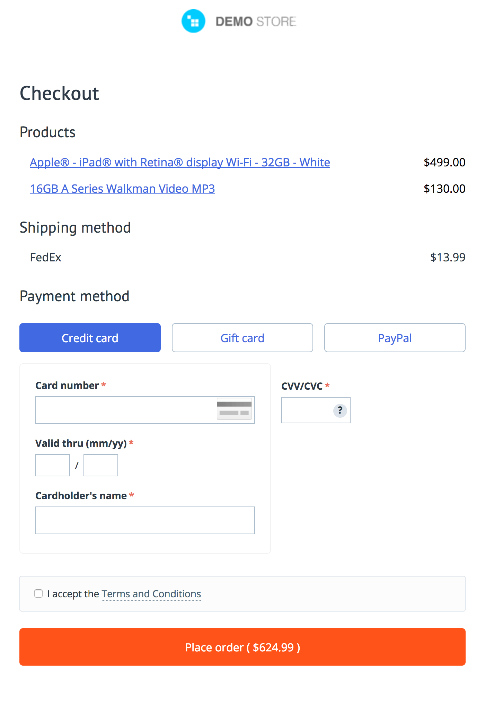

# Тестовое задание для junior frontend-разработчика

## Задача
Реализовать форму оплаты, используя данный макет:

Необходимо сверстать макет и реализовать следующую логику:
* Переключение табов Credit card, Gift card и PayPal:
    * У каждого из табов должно быть отдельное содержимое.
    * По умолчанию должен быть открытым таб Credit card.
    * Активный таб выделяется фоном.
* Внутри таба Credit card:
    * Необходимо принудительное приведение к корректному формату содержимое поля Credit card: в поле можно ввести только челые числа, которые автоматически будут объединены в группы по четыре символа, разделённые пробелами.
    * Все поля должны быть обязательны к заполнению.
    * Поле CVV Number должно быть ограничено тремя целочисленными символами.
    * При наведении мыши на иконку с вопросительным знаком внутри поля CVV Number необходимо отображать tooltip, объясняющий местонахождение CVV-кода на поверхности банковской карты. Наполнение и вёрстку tooltip реализовать произвольно в общем стиле макета.
* У остальных двух табов содержимое можно оставить пустым.
* При нажатии на Terms and Conditions должно показываться всплывающее окно.
    * Заголовок окна: Terms and Conditions.
    * Наполнение — произвольное количество абзацев lorem ipsum.
* При нажатии на Place order должны выполняться:
    * проверка корректности введенных значений в форму Credit card,
    * проверка, что отмечен чекбокс I accept the Terms and Conditions.

## Требования к результату
* Семантичная верстка на HTML 5 и CSS
* Плюсом будет использование соглашений/архитектур написания стилей MVCSS/БЭМ и т. п.
* Код должен быть структурирован, реализован в рамках парадигм MVC/MVVM/Functional programming.
* Можно использовать UI-фреймворки (Bootstrap/Foundation/Semantic UI и т. п.), либо просто сетки.
* Допускается реализация как на нативном Javascript (ES5/ES6), так и с использованием одного из популярных фреймворков. Можно использовать jQuery для работы с DOM, можно использовать Lodash/Underscore или др. подобные библиотеки для работы с данными, массивами, объектами.
* Результат вашей работы необходимо опубликовать (Github pages, Heroku, etc).
