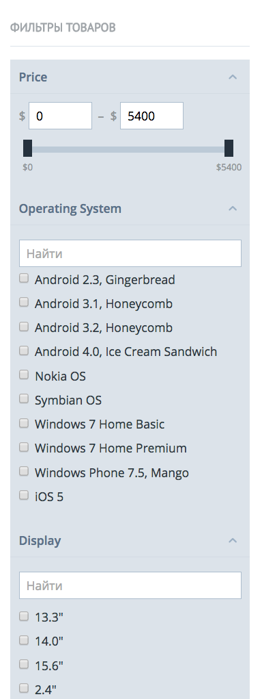

# Тестовое задание для архитектора

## Задача

Реализовать работу виджета фильтров товаров интернет-магазина на основании данных из [JSON-файла в установленном формате](./files/filters.json), который содержит всю необходимую информацию о фильтрах и их поведении.
Пример работы фильтров можно увидеть на https://demo.cs-cart.com/ в боковой колонке, если открыть категорию Electronics:

Необходимый функционал (все, что здесь не описано, реализовывать необязательно):
* Отображение списка фильтров и элементов формы, отвечающих за выбор значения фильтров.

    Фильтры могут быть разных типов, код должен быть организован таким образом, чтобы добавление новых типов было максимально простым. В рамках задачи необходимо реализовать два типа:
    * `list` - Список вариантов. Отображается как список элементов вида `input[type=checkbox]`. Сами варианты содержатся в JSON в массиве `list_variants`. Выбранное значение фильтра представляет из себя множество (массив) идентификаторов выбранных пользователем вариантов. Идентификатор варианта хранится в поле `unique_id`.
    * `slider` - Слайдер между двумя значениями (`slider_min_value` и `slider_max_value`). Выбранное значение фильтра представляет из себя объект с двумя свойствами - int `min` и int `max`. Работа ползунка слайдера и полей ввода значений `min` и `max` должна включать в себя ограничения в виде соблюдения правил: `min` >= `slider_min_value`; `max` <= `slider_max_value`; `min` < `max`. Слайдер имеет свойство `slider_value_prefix`, необходимое для визуализации (см. скриншот).

    Для типа фильтра `list` необходимо реализовать возможность изменения отображения отдельного варианта. Например для фильтра по бренду, выводить вариант **Nike** с картинкой ⭐, а вариант **Adidas** с 👟, все остальные варианты - просто текстом. Реализация должна поддерживать возможность наложения нескольких изменений. Изменения могут накладываться только другими компонентами. В рамках задачи ожидается демонстрация подобной возможности.

* Кнопка "Reset", сбрасывающая любые выбранные варианты фильтров и возвращающая слайдер на исходные позиции.
* Поиск по вариантам фильтра типа `list`. Не нужно реализовыать полнотекстовый поиск, достаточно убирать варианты, название которых *не* начинается с введенной пользователем строки в поле поиска.
* При выборе вариантов фильтров или изменении ползунка слайдера необходимо создавать JS-событие, обработчик которого должен иметь доступ к объекту, содержащему выбранные значения фильтров. Это событие потенциально необходимо для отправки данных на сервер.

## Требования к результату

1. Использовать фреймворк React.
2. Код структурировать и разделять — должна просматриваться архитектура Javascript приложения.
3. JSON-файл загружать AJAX-запросом. Пока файл не загружен, никаких элементов UI, относящихся к фильтрам, не отображать.
4. Использовать семантическую верстку, именовать блоки и элементы по БЭМ.
5. Старые браузеры не поддерживать: должно работать в самых новых версиях Firefox и Chrome.
6. Результат оформить в виде репозитория на Github.
