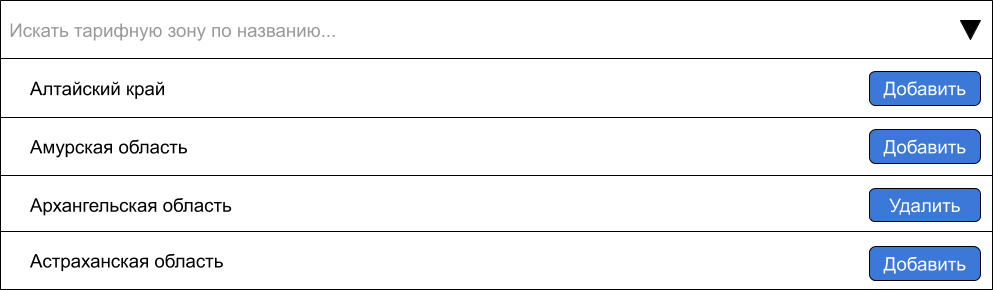
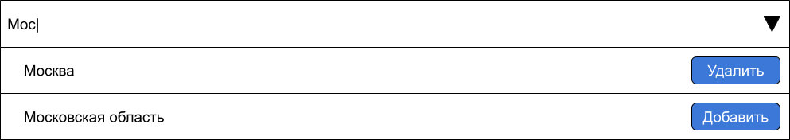
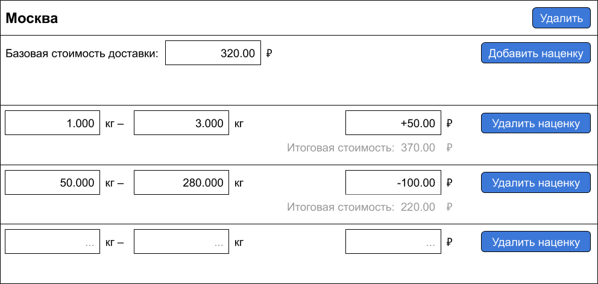

# Тестовое задание для Javascript разработчика

## Задача

Реализовать конфигуратор стоимости доставки товара в разные регионы страны с наценками за вес посылки.

Основные элементы конфигуратора:

#### 1. Элемент для поиска тарифных зон

1. Список тарифных зон грузится с бэкенда асинхронно.

    Бэкенд реализовывать не нужно — список зон нужно грузить из .

    
1. Элемент поддерживает фильтрацию по названию.

    Достаточно реализовать простой поиск и показывать только те тарифные зоны, названия которых начинаются с введенного текста.

    
1. Нажатие на "Добавить" рядом с названием тарифной зоны добавляет ее в список настроенных тарифных зон.
1. Для тарифных зон, добавленных в список настроенных тарифных зон, вместо кнопки "Добавить" отображается кнопка "Удалить", которая отменяет доставку в данную тарифную зону и убирает ее из списка.

#### 2. Список настроенных тарифных зон

1. Тарифные зоны в списке упорядочены по алфавиту.
2. Для каждой позиции в списке задается базовая стоимость доставки.

    Стоимость доставки задается в рублях с двумя знаками после запятой.

    Поле поддерживает ввод только цифр и символа ".".
3. У каждой позиции списка есть кнопка "Добавить наценку", которая добавляет новую пустую позицию в список наценок тарифной зоны.
4. У каждой позиции списка есть кнопка "Удалить". Ее поведение описано в п. 1.4.

    

#### 3. Список наценок тарифной зоны

1. У каждой позиции списка есть поля для ввода диапазона веса посылки и поле для ввода наценки.

    Вес посылки задается в килограммах с тремя знаками после запятой.

    Поле поддерживает ввод только цифр и символов ".", "+" и "-".

    Если задана положительная наценка, перед ней нужно выводить "+", если отрицательная — "-".
2. Для каждой позиции списка отображается конечная стоимость доставки.

    Конечная стоимость — сумма базовой стоимости доставки в тарифную зону (п. 2.2) и наценки.

    При измененнии базовой стоимости и наценки конечная стоимость доставки пересчитывается.
4. У каждой позиции списка есть кнопка "Удалить наценку", которая удаляет позицию списка.

    

#### 4. Кнопка "Сохранить изменения"

1. При нажатии на кнопку происходит проверка формы.
2. Если список настроенных тарифных зон пустой, должно показываться сообщение "Доставка не настроена".
3. Если для тарифной зоны не задана базовая стоимость — под полем ввода базовой стоимости должно отображаться сообщение "Укажите базовую стоимость".
4. Если в списке наценок не указаны значения в полях веса — под пустым полем должно отображаться сообщение "Укажите вес".
5. Если в списке наценок не указана наценка — под пустым полем должно отображаться сообщение "Укажите наценку".
6. Если в списке наценок тарифной зоны диапазоны веса перекрывают друг друга — под тарифной зоной должно отображаться сообщение "Диапазоны веса перекрываются".
7. Если форма не содержит ошибок — показывается сообщение "Сохранено" и в консоль логируется состояние формы в следующем формате:
    ```json
    [
      {
        "rate_area_id": ID-тарифной-зоны,
        "base_charge_value": базовая-стоимость-доставки,
        "extra_charges": [
          {
            "min_weight": минимальный-вес-диапазона,
            "max_weight": максимальный-вес-диапазона,
            "charge_value": величина-наценки
          },
          ...
        ]
      }
    ]
    ```

## Требования

1. Реализовать на jQuery (допустимо использование любых плагинов) или чистом Javascript (ECMAScript 6).
2. JSON-файл должен загружаться AJAX-запросом. Пока файл не загружен, никаких элементов UI, относящихся к фильтрам, не должно быть отрисовано.
3. Код структурировать и разделять — должна просматриваться архитектура Javascript приложения.
4. Использовать [HTML шаблоны](https://www.w3schools.com/TagS/tag_template.asp) для элементов списков.
5. Использовать семантическую верстку, именовать блоки и элементы по БЭМ.
6. Старые браузеры не поддерживать: должно работать в самых новых версиях Firefox и Chrome.
7. Результат оформить в виде репозитория на Github.
